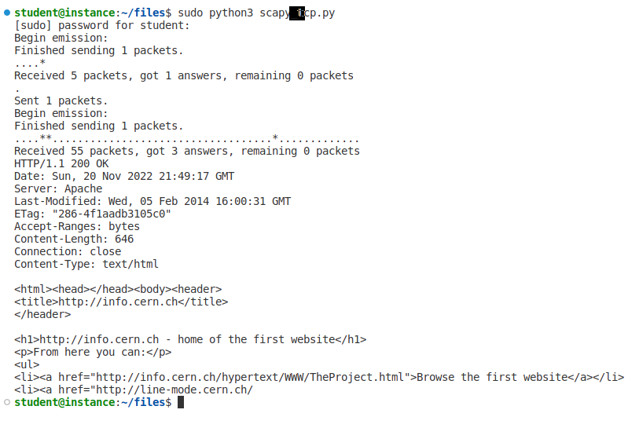
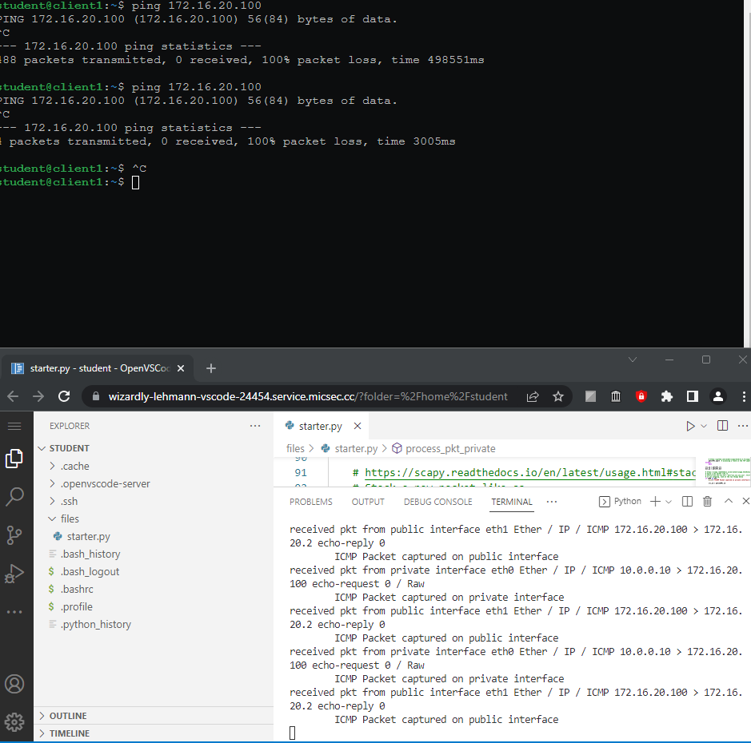
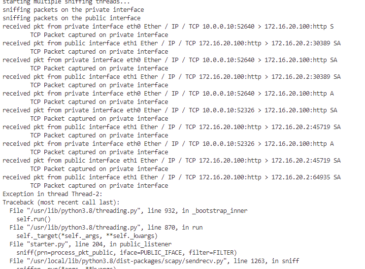

# CS436 Project 2A

---
## Project 2 - Task 1 (Project 2A)

# CS436 Project 2B
## Project 2 - Task 2 (Project 2B)
### Received packet: ICMP Packet captures between public and private interfaces

### Received packet: TCP Packet captures between public and private interfaces
